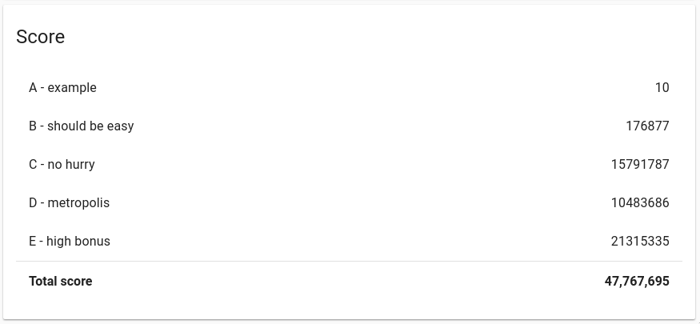
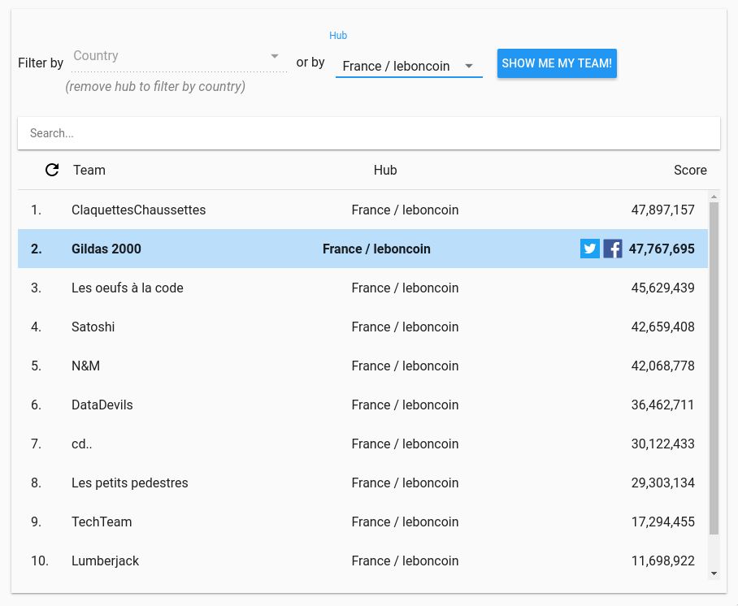
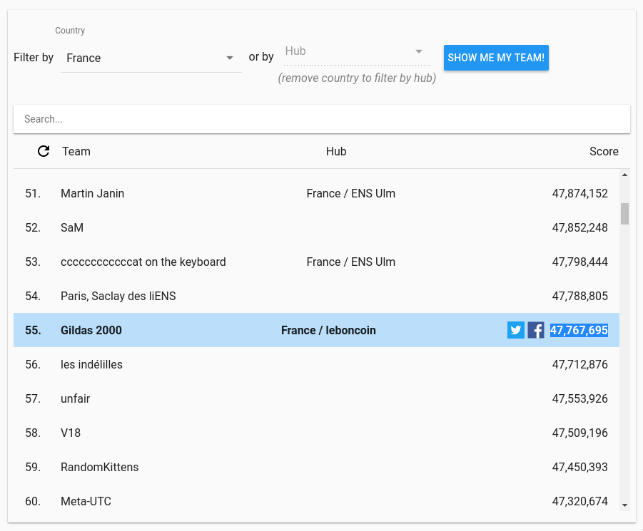

# Hashcode 2018

This is the solution from team _Gildas2000_:

- [Aylin Kocoglu](https://github.com/AylinKocoglu)
- Hélène Brulin
- [Guillaume Koenig](https://github.com/guillaumekoenig)
- [Gildas Chabot](https://github.com/gildasch)

## Score

## Some links

- https://hashcodejudge.withgoogle.com/
- Des algos (Dijkstra surtout): https://github.com/GildasCh/go-algos
- Code de l'année dernière: https://github.com/GildasCh/hashcode-2017

## Rankings

